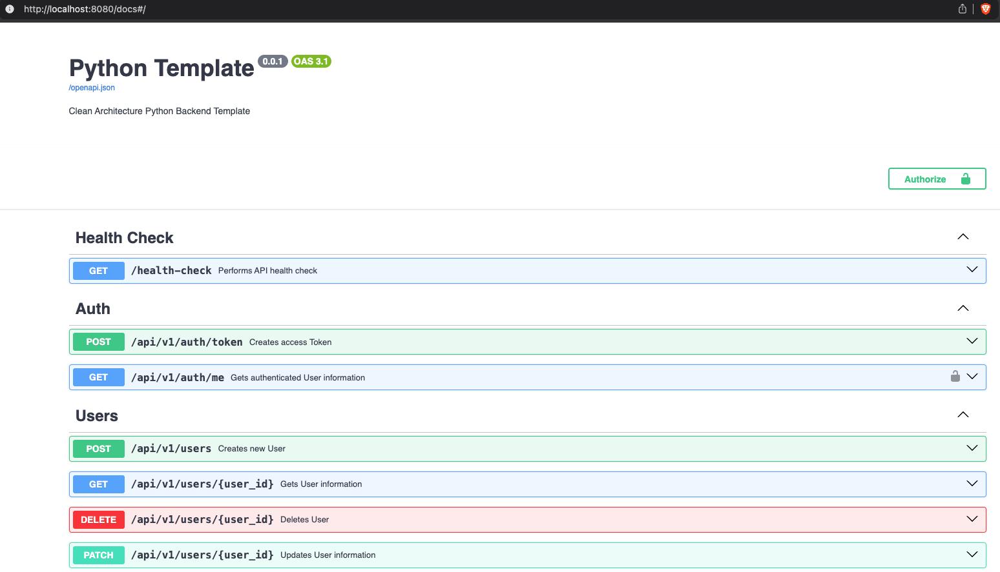

# Python Backend Template

## Overview

<p align="left">
  <a href="https://skillicons.dev">
    
  </a>
</p>

A production-ready Python backend template showcasing **Clean Architecture** with **Domain-Driven Design (DDD)** principles using modern Python. It demonstrates how to structure applications with proper separation of concerns, comprehensive testing, and type safety.

## Technology Stack

This template provides a solid foundation that can be easily extended for any domain. It features:

- Language: [Python 3.12](https://www.python.org/)
- Container: [Docker](https://www.docker.com/), and [Docker Compose](https://docs.docker.com/compose/)
- Package management: [Poetry](https://python-poetry.org/)
- Web framework: [FastAPI](https://fastapi.tiangolo.com/)
- Web server: [Uvicorn](http://www.uvicorn.org/)
- Database: [Postgres](https://www.postgresql.org/)
- Database migrations: [Alembic](https://alembic.sqlalchemy.org/en/latest/)
- ORM: [SQLModel](https://sqlmodel.tiangolo.com/)
- Password hashing: [Passlib](https://passlib.readthedocs.io/)
- Authentication: [OAuth2 + JWT](https://fastapi.tiangolo.com/tutorial/security/oauth2-jwt/)
- Testing: [Pytest](https://docs.pytest.org/en/latest/)
- Linter: [Ruff](https://github.com/astral-sh/ruff)
- Type checker: [Mypy](https://mypy.readthedocs.io/en/stable/index.html)
- Code formatter: [Ruff](https://github.com/astral-sh/ruff)
- Pre-commit hooks: [Pre-commit](https://pre-commit.com/)
- Local [development hot reload](#hot-reload), [watch](#watch-mode-for-tests) mode for tests, full [Asyncio](https://docs.python.org/3/library/asyncio.html) support, etc...

## What's Included

- **User Management**: Complete user CRUD operations with proper DTOs and use cases
- **Authentication System**: JWT-based authentication with OAuth2 support
- **Clean Architecture Structure**: Well-organized layers with clear boundaries
- **Value Objects**: Email, Password, and ID (UUID-validated) value objects with validation
- **Repository Pattern**: Abstract interfaces with concrete implementations
- **Unit of Work Pattern**: Transaction management across repositories
- **Centralized Exception Handling**: Domain-specific exceptions for better error management
- **Comprehensive Tests**: Unit tests using mocks and integration tests
- **Development Tools**: Hot reload, test watch mode, and pre-commit hooks

📚 **Documentation:**
- [FAQ & Architecture Guide](docs/FAQ.md) - Architecture overview and common questions

## Usage

While it's possible to run the application locally just using Python, it's highly recommended to install [Docker](https://www.docker.com/) to keep your local environment clean and facilitate the use of all the features.

### Configuration

The application uses environment variables for configuration. You can check all the available options [here](app/config.py). You can create and fill a `.env` file using the [.env.example](.env.example) file as a reference, or set them manually like this:

```sh
export DB_URL="<database_url>"
export JWT_SECRET_KEY="<my_super_secret_key>"
...
```

If using Docker, just edit the environment variables on [docker-compose.yml](./docker-compose.yml).

### Installing

Activate your Python [virtual environment](https://docs.python.org/3/library/venv.html) and run:

```sh
poetry install

# or

pip install .
```
### Type Checking

```sh
mypy app tests
```

### Linting

```sh
ruff check .
```

### Code Formatting

```sh
ruff format app tests/
```

### Pre-commit Hooks

The template uses pre-commit hooks to automatically run linting, formatting, and type checking before commits:

```sh
# Install pre-commit hooks (run once after cloning)
make pre-commit-install

# Run all pre-commit hooks manually
make pre-commit-run

# Hooks will run automatically on git commit
# To bypass hooks temporarily: git commit --no-verify
```

### Starting the Application

⚠️ If not using Docker, remember to run the [init.sql](scripts/pg/init.sql) in your local database before running the application.

```sh
# Local development (requires local PostgreSQL)
alembic upgrade head && poetry run app

# or
alembic upgrade head && python -m app

# with Docker - Production build (optimized image)
docker compose up app pg-db -d

# with Docker - Development build (with hot reload and dev dependencies)
docker compose up app-dev pg-db -d

# Using Make commands
make docker-up          # Production Docker setup
make docker-up-dev      # Development Docker setup with hot reload
```

Then, open the browser on [http://localhost:8080/docs](http://localhost:8080/docs) to see the OpenAPI docs:



### Tests

```sh
# to run all the tests
pytest

# to run only the unit tests
pytest tests/unit/

# to run only the integration tests
pytest tests/integration/

# with Docker
docker compose up tests
```

## Development Workflow

### Hot Reload

By [default](/app/config.py#16), hot reload is configured independently of whether you're using Docker or not, so you can have faster development feedback like this:


### Watch Mode for Tests

Tests can also be triggered automatically whenever a test file is modified due to the use of [pytest-watch](https://pypi.org/project/pytest-watch/), which leads to a nice and efficient TDD workflow:


For other options, you can use:

```sh
# to watch all project tests (using dev image with dependencies)
docker compose up watch

# to watch only unit tests
docker compose up watch-unit

# to watch only integration tests
docker compose up watch-integration

# without Docker
ptw -w -c tests/
ptw -w -c tests/unit/
ptw -w -c tests/integration/

# Using Make commands for local development
make watch-tests           # Watch all tests
make watch-unit-tests      # Watch unit tests only
make watch-integration-tests # Watch integration tests only
```

## License

This project is licensed under the MIT License - see the [LICENSE](LICENSE) file for details.
